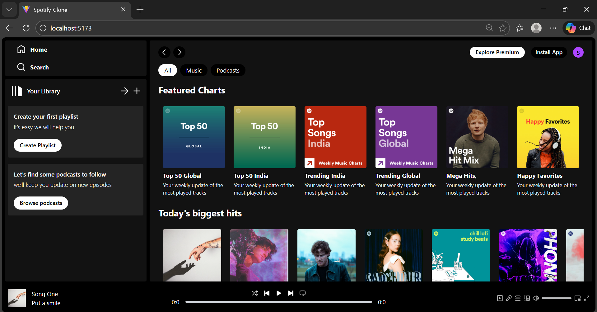
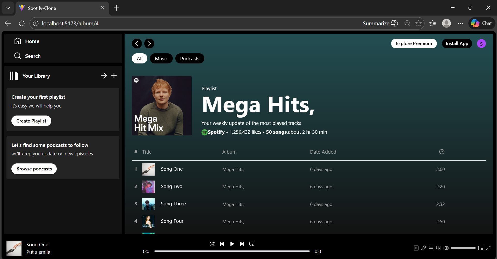

# 🎧 Spotify Frontend Clone (React)

A **Spotify-inspired frontend music player** built using **React**, **Context API**, **React Router**, and **Tailwind CSS**.
This project focuses on UI, component architecture, global state management, and audio playback logic.

> ⚠️ This is a **frontend-only clone** created for learning purposes. No real Spotify APIs are used.
---

## 🚀 Features

* 🎵 Music playback using HTML5 `<audio>`
* ⏯️ Play / Pause / Next / Previous controls
* 📀 Album-wise song navigation
* 📊 Seek bar with real-time progress update
* 🌈 Dynamic background based on album
* 🌍 Global player state using Context API
* 🧭 Routing with React Router
* 📱 Responsive UI (Tailwind CSS)

---

## 🛠️ Tech Stack

* **React.js**
* **React Router DOM**
* **Context API**
* **Tailwind CSS**
* **JavaScript (ES6+)**

---

## 📂 Project Structure

```
src/
├── assets/          # Images, songs & data files
├── Components/      # Reusable UI components
│   ├── AlbumItem.jsx
│   ├── SongsItem.jsx
│   ├── Navbar.jsx
│   └── Player.jsx
├── Context/
│   └── PlayerContext.jsx
├── Pages/
│   ├── DisplayHome.jsx
│   └── DisplayAlbum.jsx
├── App.jsx
├── main.jsx
```

---

## 🧠 Key Concepts Learned

* Component-based architecture
* Props & state flow in React
* Global state management using Context API
* `useRef` for controlling audio and DOM elements
* `useEffect` for side effects (time updates, UI sync)
* Dynamic routing using `useParams` & `useNavigate`
* Tailwind utility-first styling 

---

## ▶️ How Audio Player Works

* `<audio>` element is controlled using `useRef`
* Playback state is stored in Context
* Song progress updates using `ontimeupdate`
* Seek bar width updates dynamically
* Clicking a song triggers playback via song ID

## 📸 Screenshots
---
### Home Page


### Album Page
 

---

## 🙌 Acknowledgements

This project was built as a **learning exercise** to better understand real-world React applications and frontend architecture.

---

## 👩‍💻 Author

**Sakshi Kirola**
Frontend Developer (Fresher)

* GitHub: [https://github.com/Sakshikirola]
* LinkedIn: [https://www.linkedin.com/in/sakshi-kirola-24797232b/]  

---

⭐ If you like this project, feel free to star the repository!
